## [Crushing it](https://www.youtube.com/watch?v=E3kP2A80KIw) since 2006

Below you can find screenshots of applications I've created and code links to some of my personal projects. Many projects are still in early stages and some are experimental.

### F5 Cluster Manager
**_Easily manage a single F5 device or multiple devices_**

Faced with a vendor UI that did not meet the user needs of daily interaction with large groups of instances, I created the F5 Cluster Manager. This applications provides the following benefits: 

* Avoid the need to drill down into individual groups to easily see the cluster status of the individual group members
* Quickly enable/disable group members by dragging your mouse over the members you want to disable/enable
* Manage group members across multiple F5 devices

**Check out the code that made this happen below:**

* [Frontend Code](https://github.com/jtba/f5mgmt_frontend)
* [Backend Code](https://github.com/jtba/f5mgmt_backend)

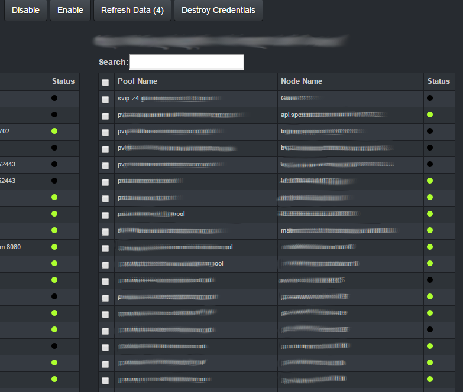

### Team Portal
**_All operation tasks in a single application_**

I'm lazy, but in a productive way. Disenchanted by the dozens of applications we had to perform our daily duties, I architected and developed a web application using Angular and PHP to bring everything my team needed, under a single UI. It features: 

* The ability to reset passwords across multiple application platforms (Tomcat, WebMethods, WebLogic, Oracle) spanning hundreds of servers in less than a minute
* Automatically collect application configuration for quick comparison across your entire cluster
* Central CMDB that allows the team to stay in control of their environment
* Create F5 I-Rules
* Track releases as they are occurring
* Suspend/Activate traffic to specific application instances

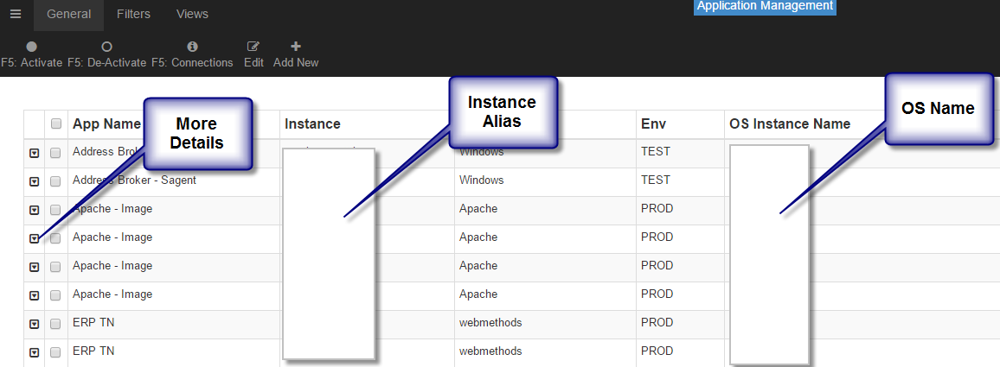
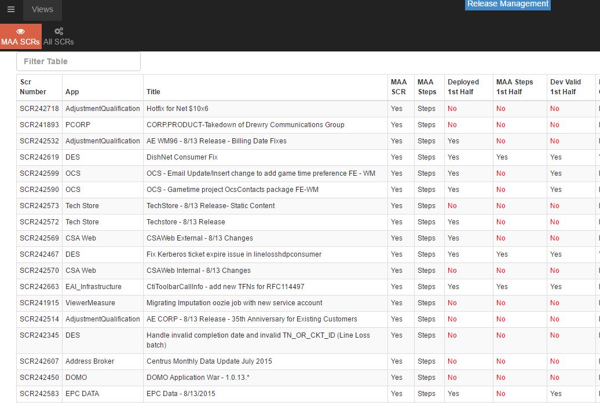

### Praxis
**_Create/Deploy/Configure with a click of a button_**

Around the time DevOps first became known, I co-developed an application with the goal of allowing any user to easily specify build templates via a GUI which is then handed to a PHP middleware that orchestrates the following:

* Creation of a Linux virtual machine by talking to VCenter
* Deployment of applications (Apache, Nginx, Tomcat, webMethods) utilizing Chef
* Creation of F5 VIP's, Pool's, and Members
* Configure applications via JSON

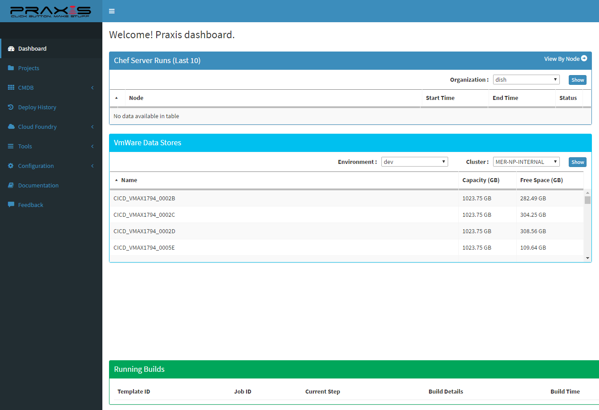
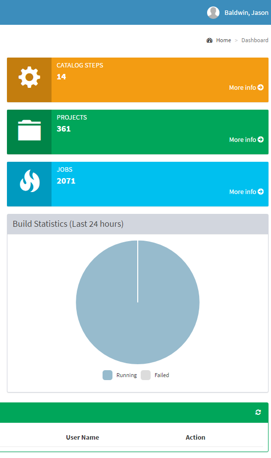
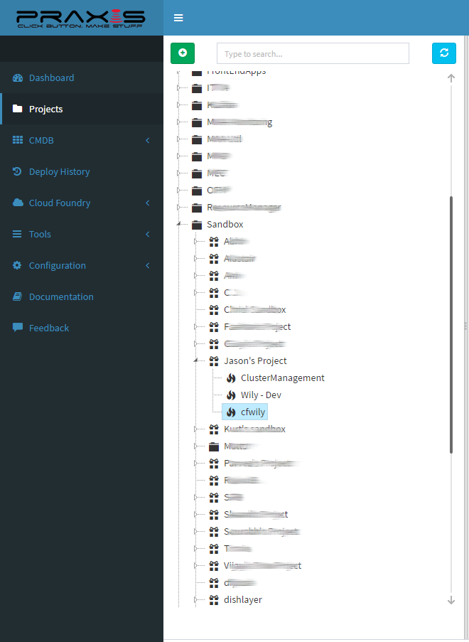
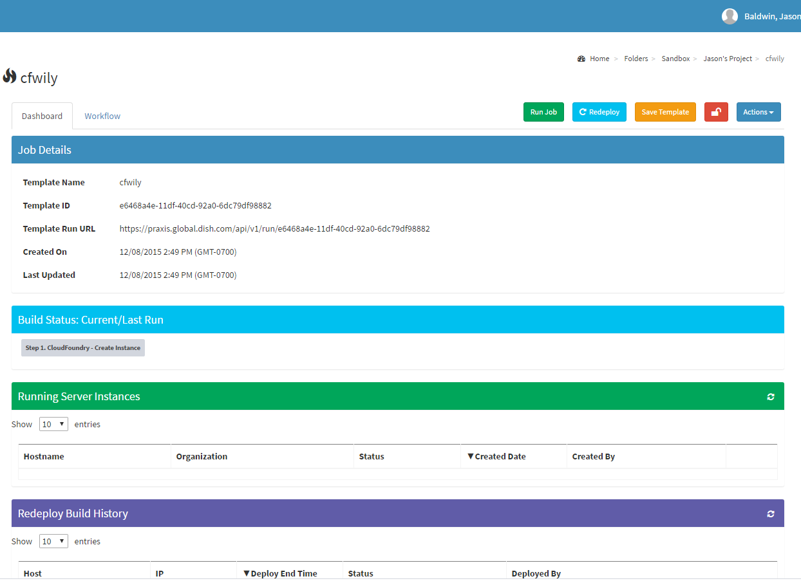
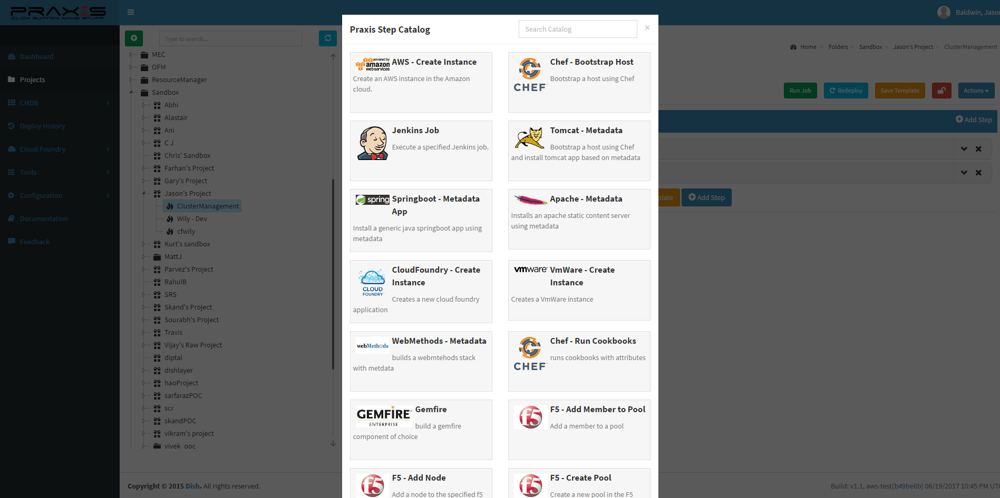
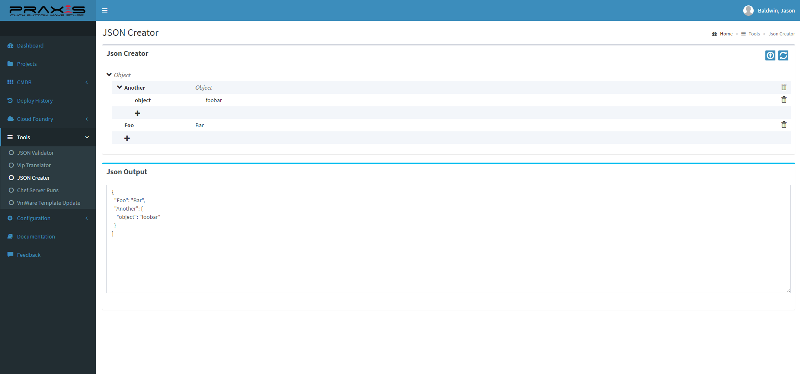

### Grafana Dashboards
**_The real power of these dashboards are in the hand crafted API's powered by NodeJS_**

I've discovered quick wins by leveraging Grafana and ElasticSearch to graph time series data. This allowed for me to focus on creating several NodeJS services that integrate with the following technologies: 

* Oracle
* Teradata
* SOAP
* REST
* Kafka

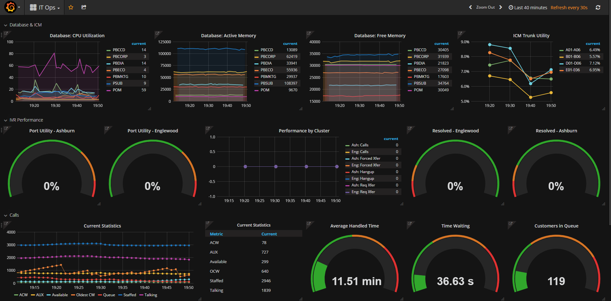

### [Scrumster](https://github.com/jtba/scrumster) ([_View Code_](https://github.com/jtba/scrumster))
**_Help your team and yourself by using this daily task tracker_**

Performing daily stand-ups without discussing what was completed the day prior ignore critical information needed to evaluate how you and your team is performing on a daily basis. The Scrumster application complements your daily stand-up by allowing individuals to thoughtfully determine what their tasks are for the day, and easily keep track of tasks missed.

Features: 

* Helps to improve your ability to estimate time taken on tasks and your ability to accomplish them
* Encourages breaking down user stories into manageable chunks
* Distinguishes between planned tasks vs unplanned, further enabling managers to determine if outward forces are impacting employees
* As a manager, improves your one on one's by giving your employees solid stats on their performance
* As a manager, improves your reporting to upper management by your ability to individually list each employee's accomplishments
* Promotes high performing teams 

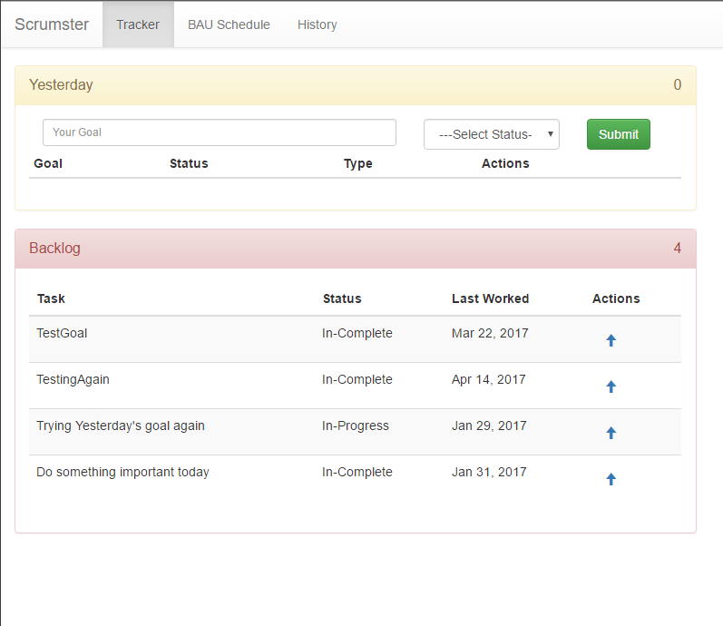
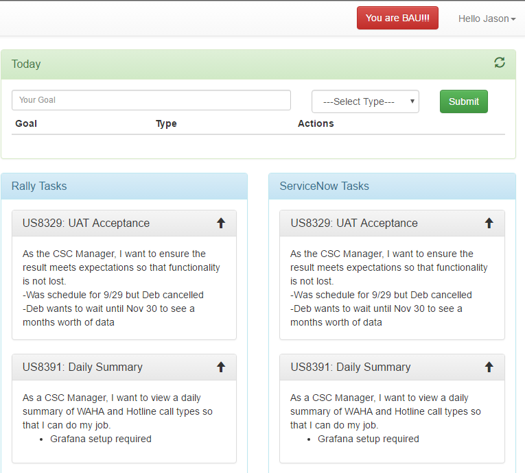

### [Debt Snowball App](https://github.com/jtba/snowball) ([_View Code_](https://github.com/jtba/snowball))
**_Destroy your debt by using the snowball method_**

Still early in development, the Snowball application (soon to be known as Budget Co-Pilot) is being created to help individuals achieve zero debt by utilizing the following features:

* Track debt payoff progress
* Share your profile with a friend for accountability
* View payoff predictions by switching between different strategies
* Setup your own custom budget 

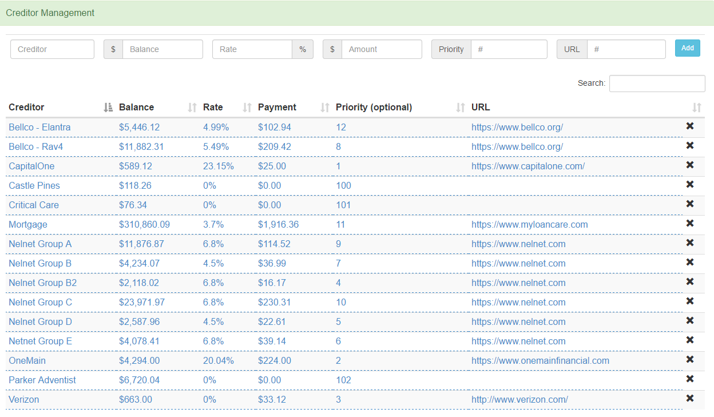

### [Jeopardy Game](https://github.com/jtba/Jeopardy) ([_View Code_](https://github.com/jtba/Jeopardy))
**_Quick and Simple Jeopardy Game using HTML/CSS/Angular_**

Developed overnight to support a team event, the Jeopardy game was a quick way to play amongst 4 teams for the highest score. The game is purely javscript/frontend driven without the need for a backend.

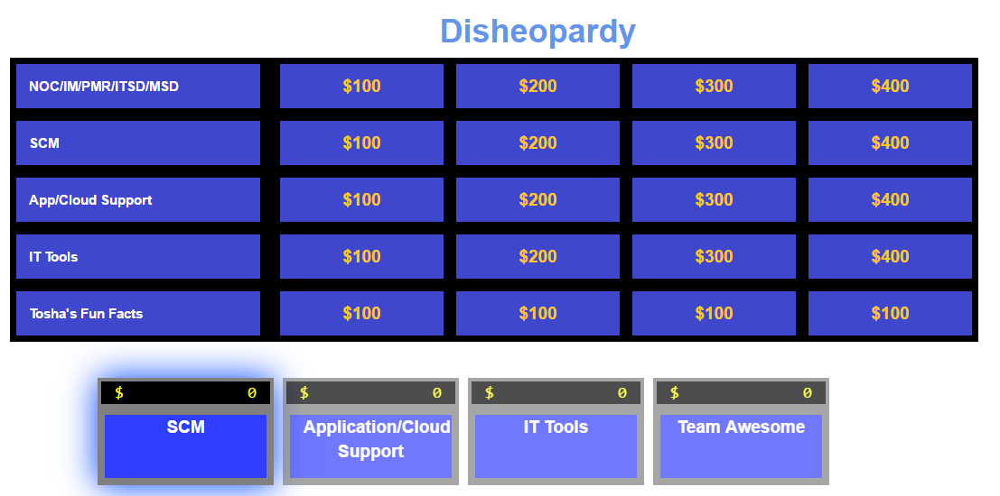